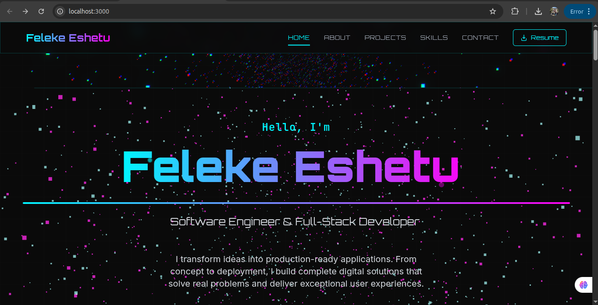

# 🚀 Feleke Eshetu - Portfolio

A modern, interactive 3D portfolio built with **React**, **Three.js**, and **Tailwind CSS**. Features cyber-themed animations, smooth transitions, and a responsive design showcasing my full-stack development projects.

## 🌐 Live Demo

[](https://feleke-portfolio.vercel.app)
[](https://github.com/xobiya/feleke-portfolio)

## ✨ Features

- **🎨 3D Animations** - Interactive particle background using Three.js
- **⚡ Modern Stack** - Built with React, Vite, and Tailwind CSS
- **📱 Responsive Design** - Optimized for all devices
- **🎯 Smooth Interactions** - Framer Motion animations and transitions
- **🌙 Cyber Theme** - Futuristic design with cyber-cyan and neon-pink accents
- **📧 Contact Form** - Functional contact form with email integration

## 🛠️ Tech Stack

### Frontend
- **React** - UI framework
- **Three.js** - 3D graphics and animations
- **Framer Motion** - Smooth animations and page transitions
- **Tailwind CSS** - Utility-first CSS framework
- **Vite** - Fast build tool and dev server

### 3D Graphics
- **React Three Fiber** - React renderer for Three.js
- **React Three Drei** - Useful helpers for React Three Fiber

### Deployment
- **Vercel** - Frontend deployment
- **Render** - Backend API deployment

## 📁 Project Structure

```
feleke-portfolio/
├── src/
│   ├── components/
│   │   ├── sections/         # Page sections (Hero, About, Projects, etc.)
│   │   ├── three/            # 3D components (ParticleField, etc.)
│   │   ├── ui/               # Reusable UI components
│   │   └── shared/           # Shared components and utilities
│   ├── data/                 # Project data and constants
│   ├── hooks/                # Custom React hooks
│   └── styles/               # Global styles and Tailwind config
├── public/                   # Static assets
└── server/                   # Backend API for contact form
```

## 🚀 Getting Started

### Prerequisites
- Node.js (version 18 or higher)
- npm or yarn

### Installation

1. **Clone the repository**
   ```bash
   git clone https://github.com/xobiya/feleke-portfolio.git
   cd feleke-portfolio
   ```

2. **Install dependencies**
   ```bash
   npm install
   ```

3. **Run the development server**
   ```bash
   npm run dev
   ```

4. **Open your browser**
   Navigate to `http://localhost:3000`

### Building for Production

```bash
# Create production build
npm run build

# Preview production build
npm run preview
```

## 📧 Contact Form Setup

The portfolio includes a functional contact form. To set up email functionality:

1. **Backend Deployment**
   - Deploy the `server/` folder to Render.com
   - Set environment variables for Gmail credentials

2. **Frontend Configuration**
   - Update `VITE_API_URL` in Vercel environment variables
   - Point to your deployed backend URL

## 🎨 Customization

### Changing Colors
Update the color scheme in `tailwind.config.js`:
```javascript
colors: {
  'cyber-cyan': '#00F5FF',
  'neon-pink': '#FF00F5',
  'dark-space': '#0A0A0A',
}
```

### Adding Projects
Edit `src/data/projects.js` to add your own projects:
```javascript
{
  id: 7,
  title: 'Your Project',
  description: 'Project description',
  image: 'project-image.jpg',
  tags: ['React', 'Node.js'],
  category: 'web',
  liveUrl: '#',
  githubUrl: '#'
}
```

## 📱 Sections

- **Hero** - 3D animated introduction with typing effect
- **About** - Skills, experience, and personal description
- **Projects** - Filterable project gallery with hover effects
- **Skills** - Technical skills with animated progress bars
- **Contact** - Functional contact form with social links

## 🌟 Performance

- **Optimized Build** - Code splitting and chunk optimization
- **Lazy Loading** - Components load as needed
- **Image Optimization** - Compressed images and modern formats
- **Smooth Animations** - 60fps animations with performance in mind

## 🤝 Contributing

While this is a personal portfolio, feel free to:
- Report bugs or issues
- Suggest new features or improvements
- Fork for your own portfolio

## 📄 License

This project is open source and available under the [MIT License](LICENSE).

## 📞 Connect With Me

[](https://github.com/xobiya)
[](https://linkedin.com/in/feleke-eshetu)
[](mailto:eshetufeleke21@gmail.com)

---

<div align="center">

**Built with ❤️ using React, Three.js, and Tailwind CSS**

⭐ Star this repo if you found it helpful!

</div>